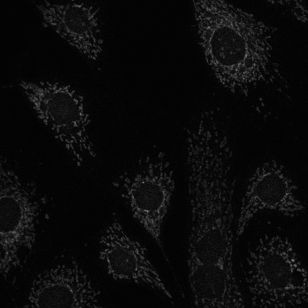
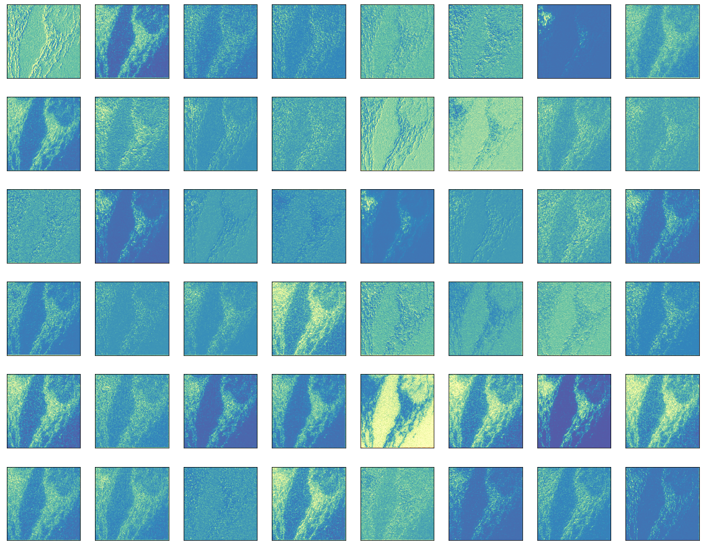
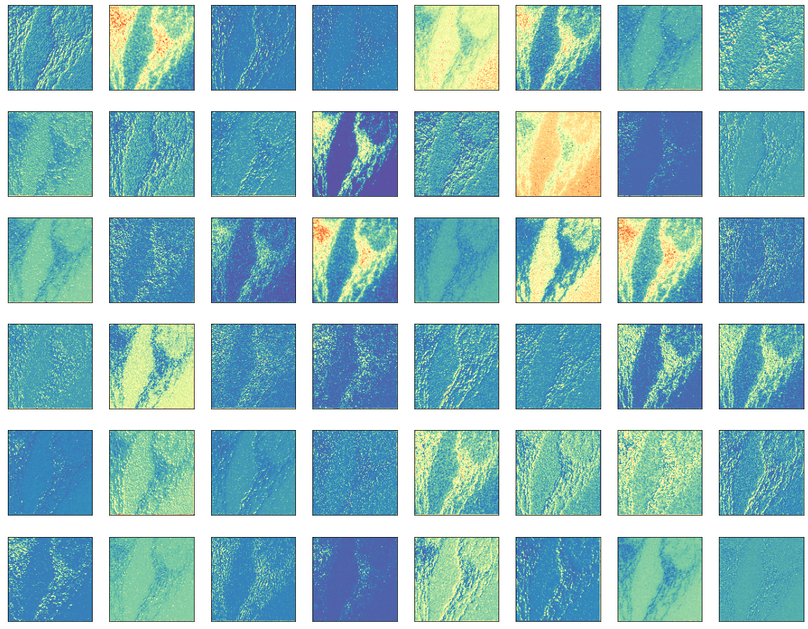
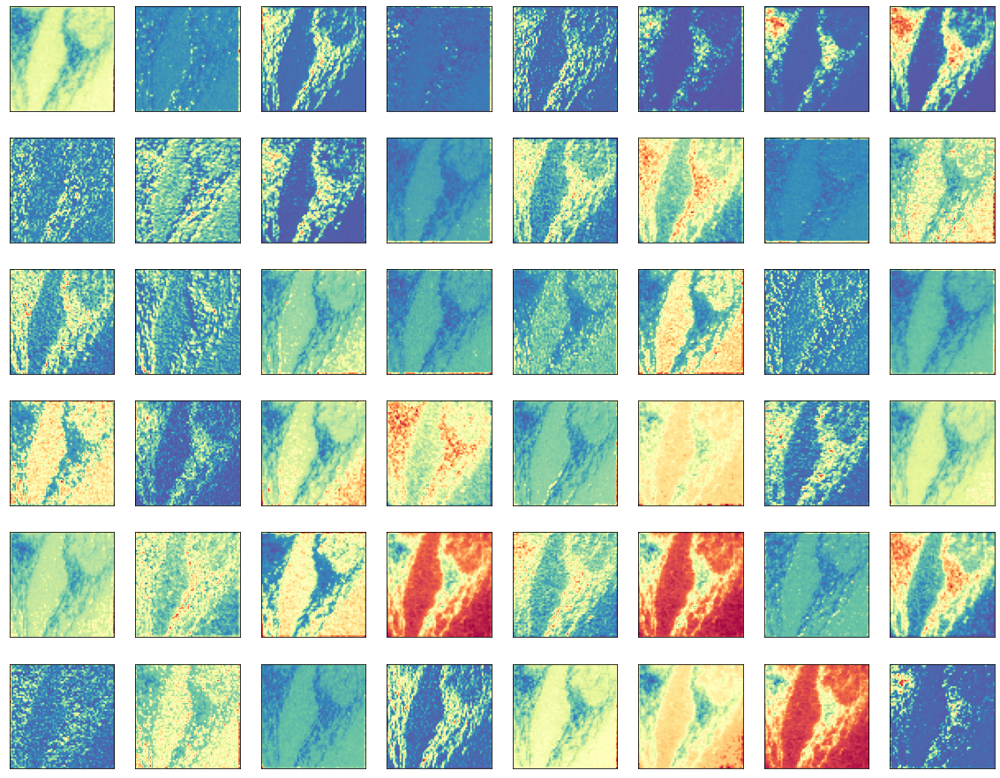
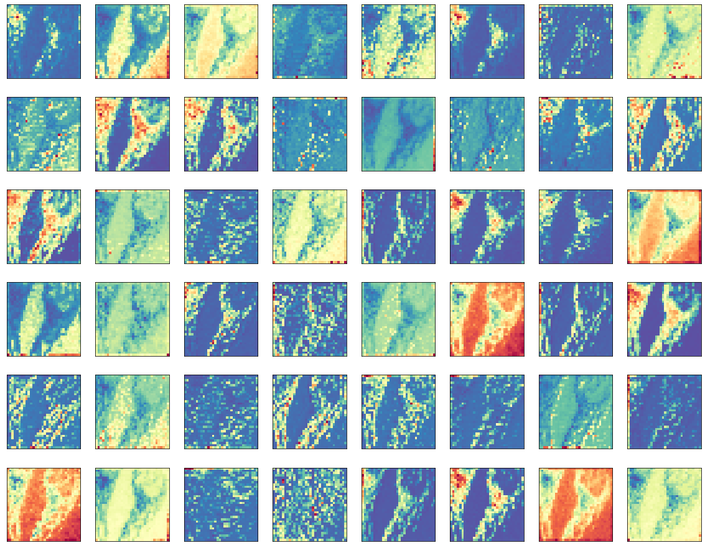
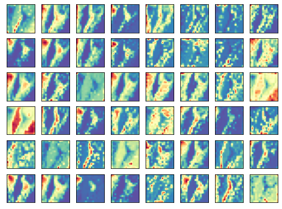

# Instant-Image-Denoising model visualization of Noise2Noise at the various encoder outputs. 

FMD dataset: 

Input Noisy Image          | Noise2Noise Plugin        | High SNR (ground truth)   |       	  
:-------------------------:|:-------------------------:|:-------------------------:|
:-------------------------:|:-------------------------:|:-------------------------:|
 |  |  |
:-------------------------:|:-------------------------:|:-------------------------:|

Encoder Layer1 output:
:---------------------------------------------------------------------------------:|

:---------------------------------------------------------------------------------:|

Encoder Layer2 output:
:---------------------------------------------------------------------------------:|

:---------------------------------------------------------------------------------:|

Encoder Layer3 output:
:---------------------------------------------------------------------------------:|

:---------------------------------------------------------------------------------:|

Encoder Layer4 output:
:---------------------------------------------------------------------------------:|

:---------------------------------------------------------------------------------:|

Encoder Layer5 output:
:---------------------------------------------------------------------------------:|

:---------------------------------------------------------------------------------:|

W2S sample:
Input Noisy Image          | Noise2Noise Plugin        | High SNR (ground truth)   |       	  
:-------------------------:|:-------------------------:|:-------------------------:|
:-------------------------:|:-------------------------:|:-------------------------:|
 |  |  |
:-------------------------:|:-------------------------:|:-------------------------:|

Encoder Layer1 output:
:---------------------------------------------------------------------------------:|

:---------------------------------------------------------------------------------:|

Encoder Layer2 output:
:---------------------------------------------------------------------------------:|

:---------------------------------------------------------------------------------:|

Encoder Layer3 output:
:---------------------------------------------------------------------------------:|

:---------------------------------------------------------------------------------:|

Encoder Layer4 output:
:---------------------------------------------------------------------------------:|

:---------------------------------------------------------------------------------:|

Encoder Layer5 output:
:---------------------------------------------------------------------------------:|

:---------------------------------------------------------------------------------:|

Details: 
Input: 2D single channel image from FMD dataset (Mitochondria (confocal)) and W2S system respectively.

## **Copyright**

© 2019 Varun Mannam, University of Notre Dame  

## **License**

Licensed under the [GPL](https://github.com/ND-HowardGroup/Instant_image_denoising/blob/master/LICENSE)

