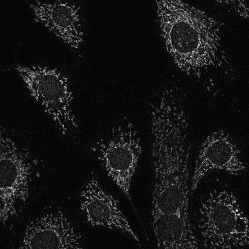

# Image denoising on the 2D images:

Input Noisy Image          | Our Denoised (Noise2Noise)| Target Image 		         |	
:-------------------------:|:-------------------------:|:-------------------------:|
   |   |   | 

# Image denoising on the 3D images (converted channels into 3D stack):

Input Noisy Image          | Our Denoised (Noise2Noise)| Target Image 		         |	
:-------------------------:|:-------------------------:|:-------------------------:|
   |   | _Images/3D_volume_gt_stack1_8bit.gif) | 
