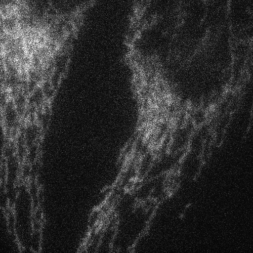
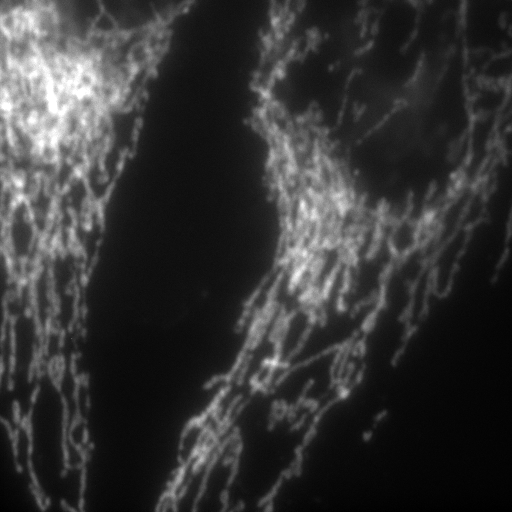

# Instant-Image-Denoising
This repository includes the code used for the image denoising of our Noise2Noise and DnCNN ML models trained on the FMD dataset microscopy images. This repository also includes the ImageJ plugin (contains pre-trained ML model and computationally much faster with GPU configuration) for image denoising on the 2D and 3D data. 

#Images: The test images can be downloaded from here https://curate.nd.edu/show/f4752f78z6t

#Citation for dataset: Please cite the FMD dataset using the following format: Mannam, Varun, Yide Zhang, and Scott Howard. “Fluorescence Microscopy Denoising (FMD) Dataset.” Notre Dame, April 21, 2019. https://doi.org/10.7274/r0-ed2r-4052. #DOI: 10.7274/r0-ed2r-4052

# Results shown in the Journal paper

2D single channel image from FMD dataset: Confocal_FISH_3.png (from confocal microscopy and sample: Zebrafish)

Image denoising using our ImageJ plugin (from trained Noise2Noise ML model): (time: 80 ms in GPU, image size: 512x512)

Target image generated by taking average of 50 noisy images in the same FOV: 

_Images/gt_Confocal_FISH_3.png)

# Comparison of Noise2Void method: (test image from the W2S dataset)

Input Noisy Image          | Denoised (Noise2Void)	   | Our Denoised (Noise2Noise)| Target Image 		         |	
:-------------------------:|:-------------------------:|:-------------------------:|:-------------------------:|
   |  | _010_0.png)  |  | 

## **Copyright**

© 2019 Varun Mannam, University of Notre Dame  

## **License**

Licensed under the [GPL](https://github.com/ND-HowardGroup/Instant_image_denoising/blob/master/LICENSE)

