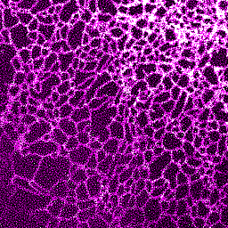
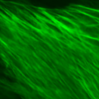
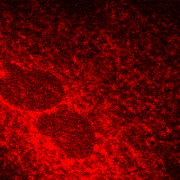
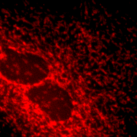

# Instant-Image-Denoising
This repository includes the code used for the image denoising of our Noise2Noise and DnCNN ML models trained on the FMD dataset microscopy images. This repository also includes the ImageJ plugin (contains pre-trained ML model and computationally much faster with GPU configuration) for image denoising on the 2D and 3D data. 

#Images: The test images can be downloaded from here https://curate.nd.edu/show/f4752f78z6t

#Citation for dataset: Please cite the FMD dataset using the following format: Mannam, Varun, Yide Zhang, and Scott Howard. “Fluorescence Microscopy Denoising (FMD) Dataset.” Notre Dame, April 21, 2019. https://doi.org/10.7274/r0-ed2r-4052. #DOI: 10.7274/r0-ed2r-4052

# Results shown in the Journal paper

Input Noisy Image          | Noise2Noise Plugin        | Target Image 		         |	
:-------------------------:|:-------------------------:|:-------------------------:|
   |  |  |

Details: 
Input: 2D single channel image from FMD dataset: Confocal_FISH_3.png (from a confocal microscopy and sample: Zebrafish)
Denoised: Image denoising using our ImageJ plugin (from trained Noise2Noise ML model): (time: 80 ms in GPU, image size: 512x512)
Target: Target image generated by taking average of 50 noisy images in the same FOV: 

# Comparison of Noise2Void image denoising method: (test image from the W2S dataset)

Input Noisy Image          | Noise2Void           	   | Noise2Noise Plugin        | Target Image 		         |	
:-------------------------:|:-------------------------:|:-------------------------:|:-------------------------:|
  |  |   |   | 
PSNR: 17.93 dB			       | PSNR: 22.29 dB			       | PSNR: 25.44 dB	           | 

# Results on the out-of-distribution structures using the Noise2Noise image denoising method: 

Input Noisy Image          | Noise2Noise Plugin        |       	  
:-------------------------:|:-------------------------:|
:-------------------------:|:-------------------------:|
 |  |
:-------------------------:|:-------------------------:|
 |  |
:-------------------------:|:-------------------------:|
 |  |
:-------------------------:|:-------------------------:|
 |  |
:-------------------------:|:-------------------------:|

Details: 
Input: 2D single channel image from CARE dataset, PN2V Convallaria dataset, CBMI dataset (Mito, ER images). 

# Results on the GigaDB dataset (of BPAE samples, membrane structures) using the Noise2Noise image denoising method: 
Input Noisy Image          | Noise2Noise Plugin        | High SNR (ground truth)   |       	  
:-------------------------:|:-------------------------:|:-------------------------:|
:-------------------------:|:-------------------------:|:-------------------------:|
 |  |  |
:-------------------------:|:-------------------------:|:-------------------------:|
 |  |  |
:-------------------------:|:-------------------------:|:-------------------------:|
 |  |  |
:-------------------------:|:-------------------------:|:-------------------------:|
 |  |  |
:-------------------------:|:-------------------------:|:-------------------------:|
 |  |  |
:-------------------------:|:-------------------------:|:-------------------------:|
 |  |  |
:-------------------------:|:-------------------------:|:-------------------------:|
 |  |  |
:-------------------------:|:-------------------------:|:-------------------------:|

Details: 
Input: 2D single channel image from GigaDB dataset (Nucleus, membrane, Mitochondria (confocal), Actin (WF), Mitochondria (WF) using 2 different objectives (20x and 60x) respectively ).

## **Frequently Asked Questions (FAQs)**
Some of the faq like image conversions, 2D, 3D image denoising, denoising images in a folder using macros, etc..
https://github.com/ND-HowardGroup/Instant-Image-Denoising/blob/master/FAQ_Instant_Image_Denoising.docx

## **Copyright**

© 2019 Varun Mannam, University of Notre Dame  

## **License**

Licensed under the [GPL](https://github.com/ND-HowardGroup/Instant_image_denoising/blob/master/LICENSE)

